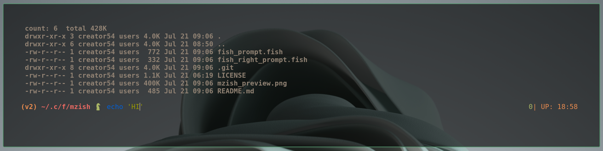

# MZish

A Fish-Shell Theme

## Left prompt
abbreviated path, ls -lah, and git branch info & a random chess-piece  ,cuz y not 

## Right prompt
Exit code, uptime

## Extras

runs ls -lah if ls|wc -l <=40 while redrawing the theme
saves typing ls everytime you do cd :P

## Session-wide config
* run `set doclr 'true'` for running `clear` at each repaint.         
* run `set dols 'false'` to remove ls-lah & uptime                              

Enjoy!
